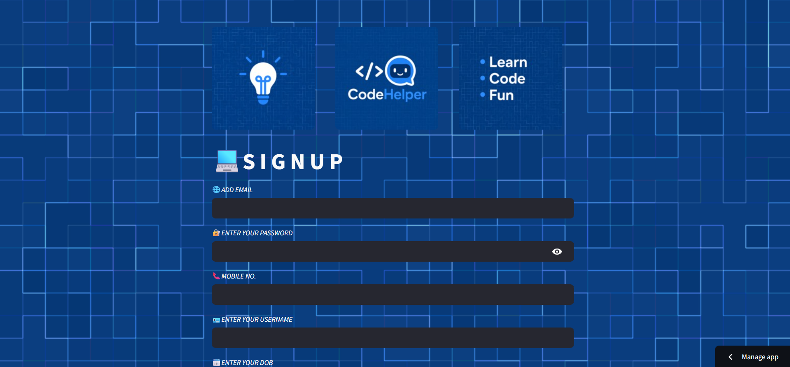
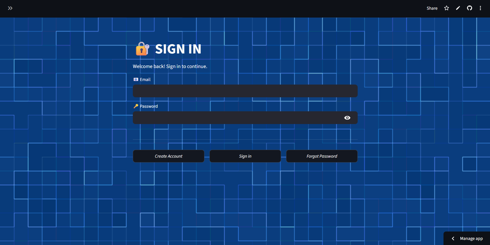
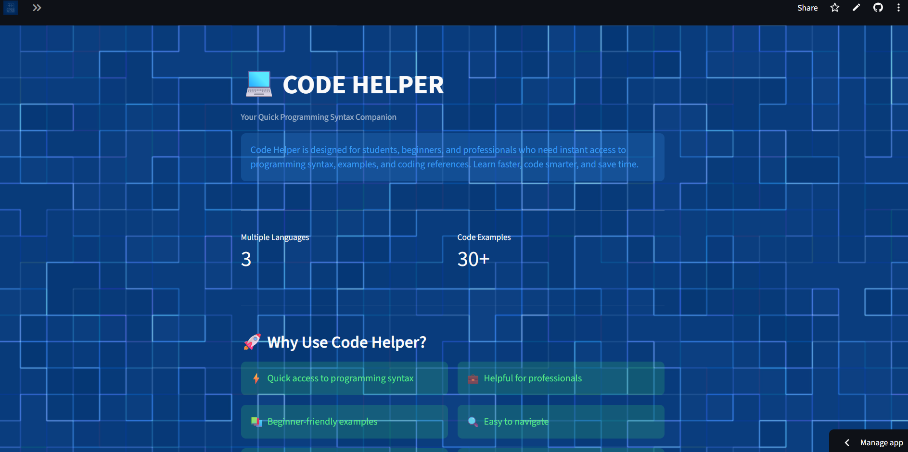
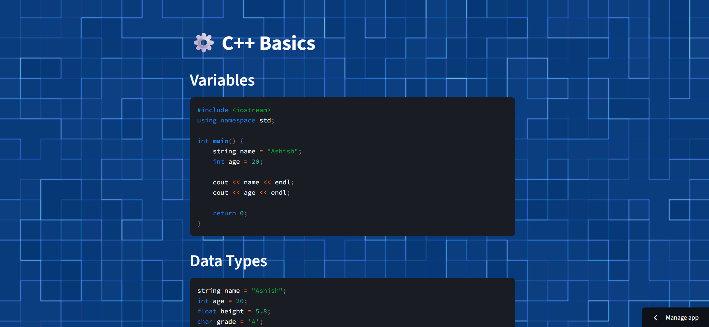
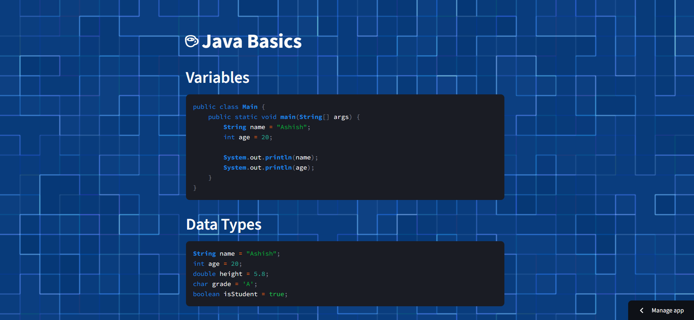
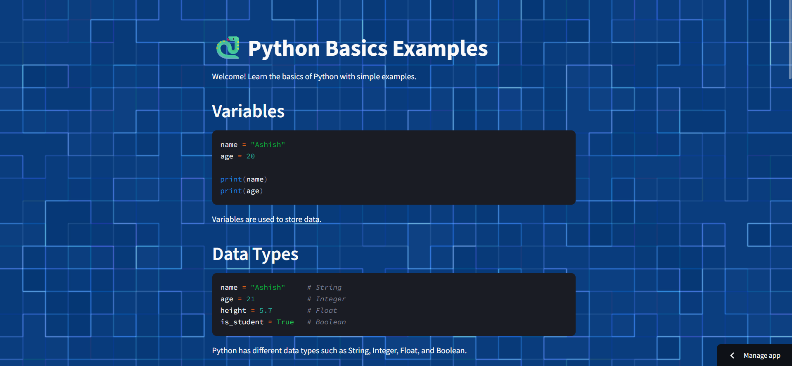

# 🚀 Code Helper

**Code Helper** is a lightweight and user-friendly application designed to provide quick access to programming syntax and code references. Whether you're a 🎓 student, 👨‍💻 developer, or 🧑‍💼 working professional, Code Helper helps you find essential syntax and examples in seconds.

## ✨ Features

* ⚡ Instant syntax lookup
* 📚 Beginner-friendly code references
* 🔍 Clean and easy-to-use interface
* 💡 Helpful for learning, projects, and interview preparation
* 🌐 Supports multiple programming concepts and languages

## 🛠️ Built With

* 🐍 **Python**
* 🎨 **Custom CSS Styling**
* 📦 **Simulate Library** for core application functionality
* 🚀 **Streamlit** for deployment and interactive web interface

## 🎯 Purpose

Instead of spending time searching through lengthy documentation, Code Helper provides a centralized place to quickly access commonly used programming syntax and references, improving productivity and learning efficiency.

## 🌟 Experience

Code Helper combines simplicity, speed, and accessibility to create a seamless coding reference experience for learners and professionals alike.

https://code-apper101-j7jnff6jjsphvn7xrp2tbp.streamlit.app/---->link

**Code Smarter. Learn Faster. Build Better. 🚀✨**

## ✍🏻 Project Structure

